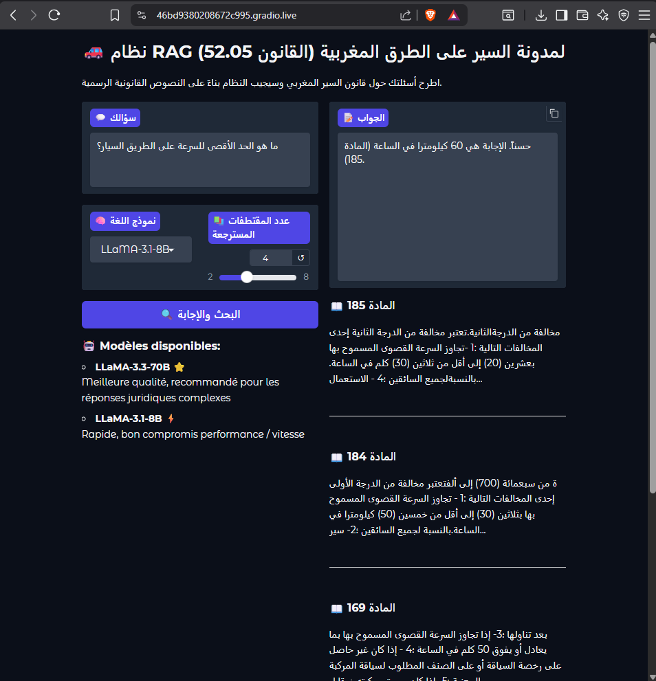

# 🚗 Moroccan Road Code RAG System (Code de la Route 52.05)

An intelligent **Retrieval-Augmented Generation (RAG)** system designed to answer legal questions about the Moroccan road traffic law (**قانون السير 52.05**) using Arabic natural language.

---

## 📌 Project Overview

This project combines:

* 🔍 **Semantic search (FAISS + embeddings)**
* 📚 **Legal document parsing (Arabic text)**
* 🤖 **Large Language Models (LLMs)**
* 💬 **Interactive interface (Gradio)**

The system retrieves relevant legal articles and generates **grounded, context-based answers** in Arabic.

---

## ⚙️ Features

* ✅ Arabic legal text processing (OCR / PDF parsing)
* ✅ Article segmentation (المادة X detection)
* ✅ Vector search using FAISS
* ✅ RAG pipeline (retrieval + generation)
* ✅ Multi-model support (LLaMA-based models)
* ✅ Out-of-domain detection
* ✅ Source attribution (articles cited in answers)
* ✅ Gradio web interface

---

## 🧠 How It Works

1. **Data Extraction**

   * قانون السير PDF → cleaned Arabic text
   * Articles parsed and structured

2. **Indexing**

   * Text split into chunks
   * Embeddings generated
   * Stored in FAISS index

3. **Retrieval**

   * User query → embedding
   * Top-k relevant articles retrieved

4. **Generation**

   * Context + question → LLM
   * Answer generated in Arabic with legal grounding

---

## 🖥️ Demo

> ⚠️ Gradio public links are temporary.
> https://46bd9380208672c995.gradio.live/
---

# 🚗 Moroccan Road Code RAG System

  

## 🧠 Architecture

  

## 🧪 Example Questions

* ما هي شروط الحصول على رخصة السياقة؟
* ما هو الحد الأقصى للسرعة داخل المدن؟
* ما هي عقوبة القيادة تحت تأثير الكحول؟

---

## 📊 Evaluation

The system evaluates:

* ⏱ Latency per model
* 📚 Number of retrieved sources
* 🎯 Answer quality (grounded vs hallucinated)

---

## ⚠️ Limitations

* Performance depends heavily on retrieval quality
* Some OCR noise may affect results
* LLMs may hallucinate if context is weak
* API-based models may be unstable (deprecated models)

---

## 🔮 Future Improvements

* Hybrid search (BM25 + embeddings)
* Cross-encoder reranking
* Arabic NLP normalization
* Local LLM integration (Ollama)
* Persistent deployment (Hugging Face Spaces)

---

## 👨‍💻 Author

Ashraf — Data Engineering & AI student

---

## 📄 License

This project is for educational purposes.
